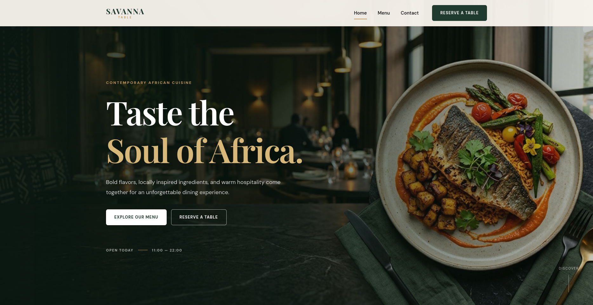
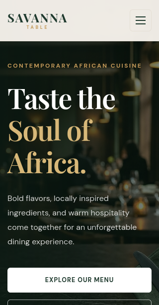
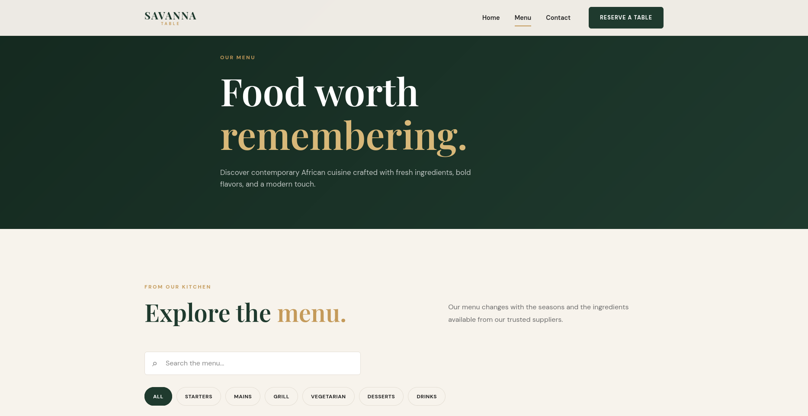
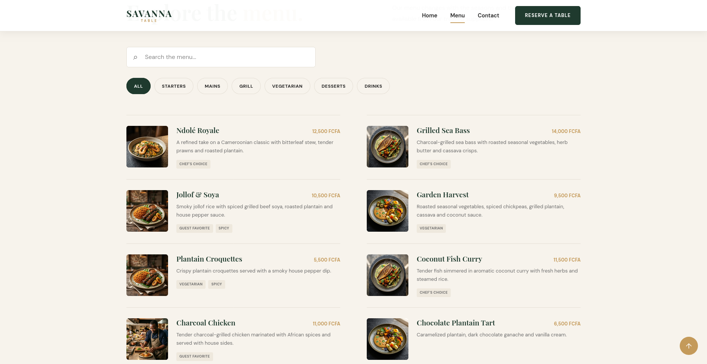
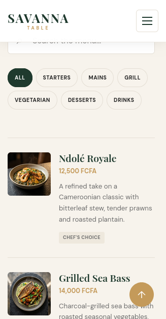
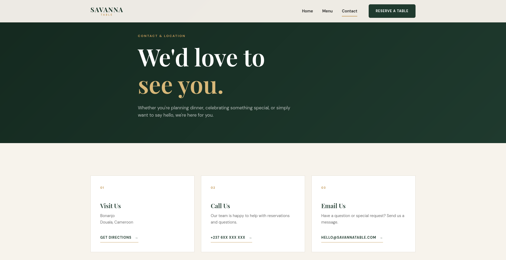
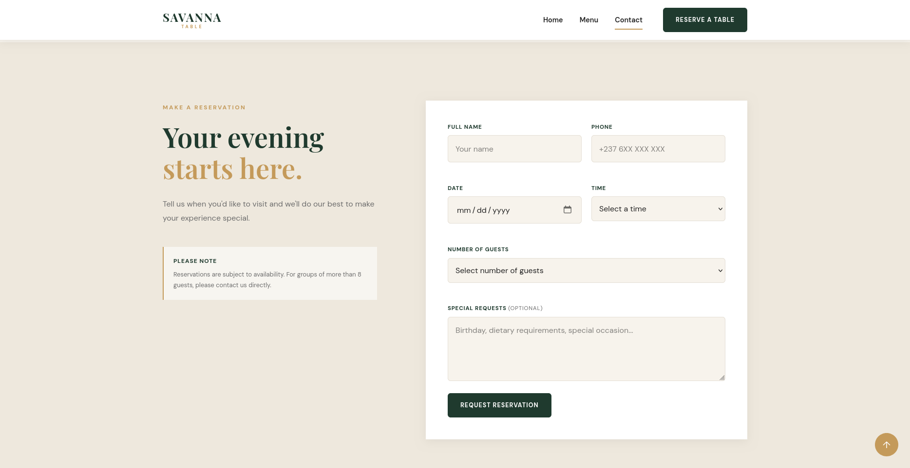
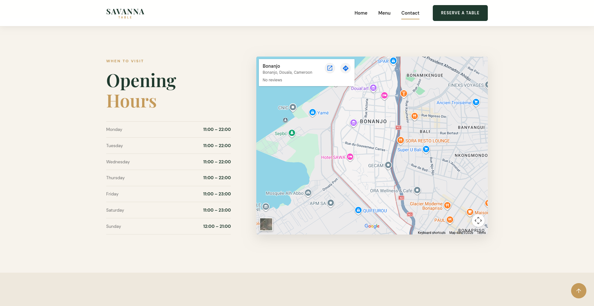
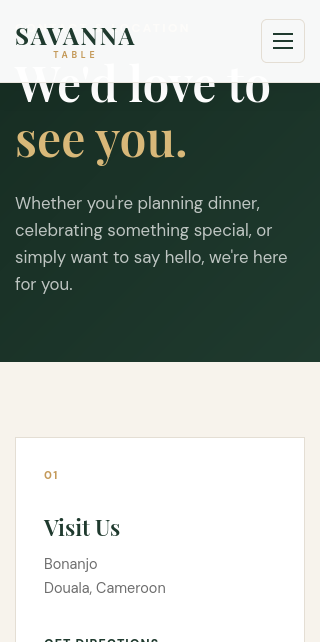

# Savanna Table 🍽️

A modern, responsive restaurant website designed for **Savanna Table**, a contemporary African dining concept focused on bold flavors, fresh ingredients, and warm hospitality.

The project was built from scratch using HTML, CSS, and JavaScript, with an emphasis on responsive design, clean UI, usability, and maintainable frontend structure.


## 📸 Screenshots

### Homepage

The homepage introduces the Savanna Table brand through a large visual hero, restaurant story, featured dishes, philosophy, chef section and calls-to-action.



### Mobile Homepage



---

### Interactive Menu

The menu provides category filtering, search functionality, dish descriptions, pricing and dietary/specialty tags.



### Menu Filtering



### Mobile Menu



---

### Contact & Location

The contact page combines restaurant information, reservation functionality, opening hours, location information and Google Maps.



### Reservation & Contact Forms



### Location



### Mobile Contact




## ✨ Features

### Homepage

* Full-width restaurant hero section
* Restaurant introduction
* Featured dishes
* Restaurant philosophy
* Chef section
* Customer testimonials
* Location/visit section
* Multiple calls-to-action
* Responsive navigation

### Interactive Menu

* Organized menu categories
* Category filtering
* Menu search functionality
* Dish descriptions and prices
* Dietary and specialty tags
* Responsive menu layout
* Empty search state
* Dynamically rendered menu items using JavaScript

### Contact & Location

* Restaurant contact information
* Opening hours
* Google Maps integration
* Reservation request form
* Contact form
* Client-side form validation
* Social media links
* Responsive layout

---

## 🛠️ Tech Stack

| Technology  | Purpose                                                  |
| ----------- | -------------------------------------------------------- |
| HTML5       | Page structure and semantic markup                       |
| CSS3        | Layout, responsive design, animations and styling        |
| JavaScript  | Menu filtering, search, navigation and form interactions |
| Google Maps | Location integration                                     |
| WebP / JPEG | Restaurant imagery                                       |

No frontend framework or CSS framework was used. The website was built with vanilla HTML, CSS and JavaScript.

---

## 📁 Project Structure

```text
savanna-table/
│
├── index.html
├── menu.html
├── contact.html
│
├── css/
│   └── style.css
│
├── js/
│   └── script.js
│
├── images/
│   ├── hero-image.webp
│   ├── chef-kitchen-image.webp
│   ├── grilled-sea-bass.webp
│   ├── ndole-royale.webp
│   ├── jollof-and-soya.webp
│   ├── vegetarian-dish.webp
│   ├── drinks1.webp
│   └── ...
│
├── screenshots/
│   ├── home-desktop.png
│   ├── home-mobile.png
│   ├── menu-desktop.png
│   ├── menu-filter.png
│   ├── contact-desktop.png
│   └── contact-mobile.png
│
└── README.md
```

---

## 🎨 Design Direction

The visual identity combines contemporary restaurant design with subtle African-inspired elements.

The design uses:

* Deep natural greens
* Warm earthy tones
* Muted gold accents
* Editorial typography
* Large food photography
* Generous whitespace
* Strong visual hierarchy
* Subtle animations and interactions

The goal was to create an experience that feels **premium without being overly complicated**.

---

## 📱 Responsive Design

The website was designed to work across:

* Desktop
* Laptop
* Tablet
* Mobile devices

Responsive layouts adapt navigation, typography, menu cards, forms, imagery and spacing to smaller screen sizes.

---

## ⚡ Performance

The project uses several frontend performance practices:

* Responsive layouts without unnecessary frameworks
* Lazy loading for below-the-fold images
* WebP image optimization
* High-priority loading for the primary hero image
* Minimal JavaScript dependencies
* No external UI framework
* Lightweight vanilla CSS and JavaScript

---

## 🚀 Running Locally

Clone the repository:

```bash
git clone https://github.com/YOUR_USERNAME/savanna-table.git
```

Enter the project:

```bash
cd savanna-table
```

The website does not require a build process.

Simply open:

```text
index.html
```

in a browser.

For a better development experience, you can also use a local development server such as VS Code Live Server, PyCharm's built-in web server, or Python's HTTP server:

```bash
python3 -m http.server 8000
```

Then open:

```text
http://localhost:8000
```

---

## 🔮 Future Improvements

Potential future versions could introduce:

* Backend reservation management
* Email notifications
* Online table availability
* Restaurant administration dashboard
* Database-backed menu management
* Online ordering
* Customer reservation history
* WhatsApp reservation integration

These features would require a backend such as FastAPI and a database.

---

## 🎯 Project Goals

This project was created to demonstrate practical frontend development skills through a realistic business website rather than a simple tutorial project.

The main goals were:

1. Create a professional restaurant brand experience.
2. Build a fully responsive multi-page website.
3. Implement useful JavaScript interactions.
4. Practice semantic HTML and structured CSS.
5. Optimize images and frontend performance.
6. Produce a project suitable for real-world client work.

---

## 👨‍💻 Author

**Michel**

Built as a frontend web development project focused on creating polished, practical websites for real-world businesses.

---

## 📄 License

This project is available for educational and portfolio purposes.

